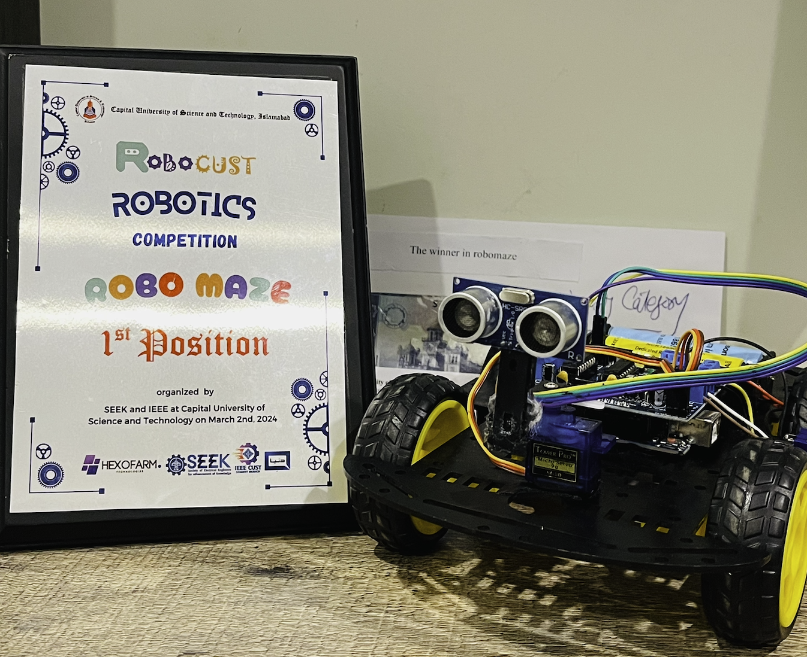

# 🚗 Obstacle Avoidance Car — *The Maze-Solver-Car*

<div align="center">


### 🏆 1st Position — Robo Maze Category
**RoboCUST Robotics Competition**  
Organized by SEEK & IEEE at Capital University of Science and Technology, Islamabad  
📅 March 2nd, 2024

</div>

---

> An autonomous robot car that detects obstacles using an ultrasonic sensor and steers around them in real-time — **battle-tested by winning a live robotics maze competition!**

---

## 📷 The Car in Action

<div align="center">


*The Maze-Solver-Car alongside its 1st place shield from RoboCUST 2024* 🏆
</div>

---

## 🧠 How It Works

```
┌─────────────────────────────────────────────────────┐
│                  OBSTACLE DETECTED?                  │
│                                                      │
│   ┌─── YES (≤15cm) ──────────────────────────────┐  │
│   │  1. Stop immediately                          │  │
│   │  2. Reverse for 300ms                         │  │
│   │  3. Look RIGHT → measure distance             │  │
│   │  4. Look LEFT  → measure distance             │  │
│   │  5. Turn toward more open side                │  │
│   └───────────────────────────────────────────────┘  │
│                                                      │
│   ┌─── NO ───────────────────────────────────────┐  │
│   │  Drive forward (gradual speed ramp-up)        │  │
│   └───────────────────────────────────────────────┘  │
└─────────────────────────────────────────────────────┘
```

1. 📡 **Measure** — HC-SR04 ultrasonic sensor continuously reads distance ahead
2. 🛑 **React** — Stops, reverses, and scans left & right when obstacle is within 15cm
3. 🔄 **Decide** — Turns toward whichever side has more open space
4. 🚀 **Continue** — Drives forward with smooth speed ramp-up to protect battery

---

## 🛠️ Hardware Used

| # | Component | Details |
|---|---|---|
| 1 | **Microcontroller** | Arduino Uno |
| 2 | **Motor Driver** | Adafruit Motor Shield v1 |
| 3 | **Drive Motors** | DC Gear Motors (x4) |
| 4 | **Steering** | SG90 Servo Motor |
| 5 | **Distance Sensor** | HC-SR04 Ultrasonic Sensor |
| 6 | **Wheels** | Rubber wheels compatible with TT gear motors |
| 7 | **Power Supply** | 18650 Li-ion Battery |
| 8 | **Wiring** | Male & Female Jumper Wires |

---

## 📦 Libraries Required

Install all three via **Sketch → Include Library → Add .ZIP File**:

| Library | Purpose | Download |
|---|---|---|
| **AFMotor** | Controls DC motors via Motor Shield | [adafruit.com](https://learn.adafruit.com/adafruit-motor-shield/library-install) |
| **NewPing** | Reads HC-SR04 ultrasonic sensor | [GitHub](https://github.com/livetronic/Arduino-NewPing) |
| **Servo** | Controls servo motor direction | [GitHub](https://github.com/arduino-libraries/Servo.git) |

---

## 🔌 Wiring / Pin Connections

| Component | Arduino Pin |
|---|---|
| HC-SR04 TRIG | A0 |
| HC-SR04 ECHO | A1 |
| Servo Signal | D10 |
| Motor 1 & 2 | Motor Shield Port 1 & 2 |
| Motor 3 & 4 | Motor Shield Port 3 & 4 |

> 💡 Motors are controlled through the **Motor Driver Shield** — connect them to the shield's screw terminals, not directly to Arduino pins. The **18650 battery** powers the motors via the shield's power input.

---

## ⚙️ Configuration

Tweak these values at the top of the sketch to tune your car's behavior:

```cpp
#define MAX_DISTANCE    200   // Maximum sonar range (cm)
#define MAX_SPEED       190   // Motor top speed (0–255)
#define MAX_SPEED_OFFSET 20   // Speed offset between motors
```

---

## 🚀 Getting Started

```bash
# 1. Clone this repository
git clone https://github.com/huda-usman/Obstacle-Avoidance-Car.git

# 2. Open in Arduino IDE
#    File → Open → ObstacleAvoidanceCar/ObstacleAvoidanceCar.ino

# 3. Install the three required libraries (see above)

# 4. Select board: Tools → Board → Arduino Uno

# 5. Upload and watch it go! 🚗
```

---

## 📁 Repository Structure

```
Obstacle-Avoidance-Car/
├── ObstacleAvoidanceCar.ino   # Main Arduino sketch
├── photo.png                  # The Maze-Solver-Car + shield photo
├── .gitignore                 # Git ignore rules
└── README.md                  # This file
```

---

## 🏅 Competition Achievement

<div align="center">

| 🏆 Event | RoboCUST Robotics Competition 2024 |
|---|---|
| 📌 Category | Robo Maze |
| 🥇 Result | **1st Position** |
| 🏛️ Venue | Capital University of Science and Technology, Islamabad |
| 👥 Organizers | SEEK & IEEE CUST Student Branch |
| 📅 Date | March 2nd, 2024 |

</div>

The car navigated a physical maze **entirely autonomously** using only ultrasonic sensing — no pre-programmed path, no mapping, pure real-time obstacle avoidance — and took **1st place** among all competing teams.

---

## 📄 License

This project is open-source under the [MIT License](LICENSE).

---

## 🙌 Acknowledgements

- [Adafruit](https://www.adafruit.com/) for the Motor Shield library
- [Tim Eckel](https://github.com/livetronic) for the NewPing library
- SEEK & IEEE CUST for organizing RoboCUST 2024

---

<div align="center">

Built in Islamabad, Pakistan 🇵🇰

</div>
